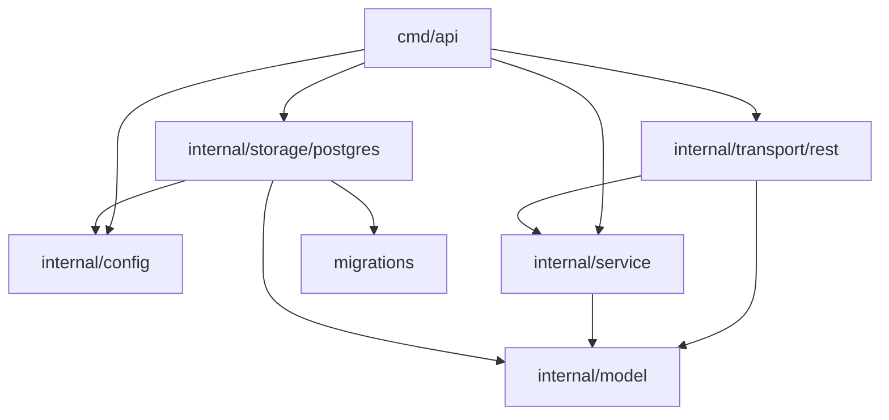
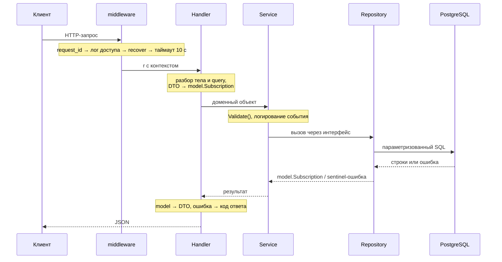

# Архитектура

Документ описывает, как сервис устроен внутри и почему именно так. Как его
запускать и какие у API ручки — в [README](README.md).

## Границы сервиса

Сервис хранит записи о подписках и считает их суммарную стоимость за период.
Пользователями он не управляет и их существование не проверяет: `user_id` —
просто идентификатор из внешней системы. Это задано в ТЗ и объясняет, почему в
схеме нет таблицы пользователей и внешних ключей.

Аутентификации нет — сервис рассчитан на работу за шлюзом, который её и
выполняет.

## Зависимости пакетов



Главное свойство — **`model` не импортирует ничего из проекта**. Стрелки идут
внутрь: транспорт знает про сервис, сервис — про модель, хранилище — про
модель; в обратную сторону не знает никто.

Отсюда правило, которое легко нарушить: типы, нужные и сервису, и хранилищу
(`Filter`, `Page`), лежат в `model` — иначе `storage/postgres` начнёт
импортировать слой выше себя. Обратная крайность тоже возможна: границы размера
страницы — политика HTTP-слоя, поэтому `DefaultLimit` и `MaxLimit` живут в
`rest`.

## Слои

| Пакет | Отвечает за | Не знает про |
| --- | --- | --- |
| `cmd/api` | сборку зависимостей, запуск и остановку процесса | бизнес-правила |
| `internal/config` | чтение настроек из окружения, построение DSN | всё остальное |
| `internal/model` | сущность подписки, её инварианты, формат даты `MM-YYYY` | HTTP, SQL |
| `internal/service` | сценарии работы с подписками, интерфейс `Repository` | HTTP, SQL |
| `internal/storage/postgres` | SQL-запросы, пул соединений, миграции | HTTP |
| `internal/transport/rest` | маршруты, разбор запроса, коды ответа, DTO | SQL |
| `migrations` | SQL-файлы схемы, встроенные через `embed` | всё остальное |

## Путь запроса



Порядок middleware не произволен: логгер стоит **снаружи** recoverer, иначе
паника разворачивает стек мимо логгера и упавшие запросы не попадают в лог
доступа вовсе. Этот порядок закреплён тестом.

## Валидация: почему в двух местах

Граница проходит по смыслу:

- **`transport/rest`** проверяет *форму*: корректность JSON, тип поля, формат
  `MM-YYYY`, разбор UUID, границы `limit`/`offset` — свойства протокола, а не
  предметной области.
- **`model.Validate`** проверяет *инварианты записи*: неотрицательная
  стоимость, непустое название, дата окончания не раньше даты начала. Эти
  правила верны независимо от того, пришла запись по HTTP или иначе.

Обе проверки собирают нарушения в `model.ValidationError` и не обрываются на
первом: клиенту незачем чинить поля по одному запросу. Тип разворачивается в
`ErrValidation`, поэтому `errors.Is` в транспорте работает как для одиночных
ошибок, а перечень уходит в поле `details` ответа — парами «поле, что не так».

Имена полей объявлены в `model` (`FieldPrice`, `FieldStartDate` и остальные).
Формально это имена из контракта API, но те же имена носят и колонки таблицы,
поэтому словарь для перевода между слоями не нужен — а сообщения сформулированы
относительно поля («не может быть отрицательной»), чтобы имя не дублировалось
в тексте.

Этапа при этом два — разбор строк в `rest` и инварианты в `model`, — но раннего
возврата между ними нет: запись собирается из того, что разобралось, и
проверяется целиком. Иначе пустое название молчало бы, пока клиент чинит формат
даты в соседнем поле, и на исправление уходило бы два запроса вместо одного.

Обратная сторона такого порядка — двойные сообщения: у неразобранного поля
`Validate` видит нулевое значение и говорит «не указано», хотя настоящая причина
в формате. Поэтому `mergeViolations` оставляет по каждому полю одно нарушение,
из первой группы, где оно встретилось, — то есть более точное сообщение о
разборе. Порядок в перечне задаёт `fieldOrder`, а не то, на каком этапе поле
споткнулось.

Границы значений в `model` повторяют ограничения колонок: `MaxPrice`
соответствует `INTEGER`, `MaxServiceNameLength` — `VARCHAR(255)`. Без этого
некорректный ввод доходил бы до Postgres и возвращался клиенту как `500` —
ошибка сервера вместо ошибки запроса.

Третий рубеж — `classify` в хранилище: ошибки Postgres, вызванные значениями из
запроса, переводятся в `ErrValidation`. Список кодов узкий намеренно — код,
недостижимый пользовательским вводом, означал бы ошибку в SQL, и `400`
замаскировал бы баг сервера под ошибку клиента.

## Ошибки

Сквозной механизм — sentinel-ошибки и `errors.Is`. Нижние слои оборачивают
причину через `%w`, транспорт разбирает цепочку и выбирает код ответа.

| Sentinel | Где объявлен | Код ответа |
| --- | --- | --- |
| `model.ErrValidation` | `model` | `400` |
| `model.ErrNotFound` | `model` | `404` |
| `model.ErrConflict` | `model` | `409` |
| `errPayloadTooLarge` | `rest` | `413` |
| `errUnsupportedMediaType` | `rest` | `415` |
| `context.DeadlineExceeded` | stdlib | `504` |
| `context.Canceled` | stdlib | ответа нет, лог `info` |
| всё остальное | — | `500`, детали только в лог |

Ошибки протокола объявлены в `rest`, а не в `model`: домена они не касаются.

**Наружу не уходят внутренние детали** — имена Go-структур, их полей и типов,
текст стандартной библиотеки, коды SQLSTATE. Но санировать ответ не значит
терять диагноз: тип `clientError` хранит два представления одной ошибки —
публичную формулировку и исходную причину. Клиент получает первую, лог — обе,
причину отдельным атрибутом `cause`. `Unwrap` возвращает обе, поэтому
`errors.Is` находит sentinel как обычно.

**Отмена запроса клиентом — не отказ сервиса.** Иначе мониторинг по
`level=ERROR` срабатывает на каждом отвалившемся клиенте.

## Модель данных

```sql
subscriptions(
    id           UUID PRIMARY KEY,
    service_name VARCHAR(255) NOT NULL,
    price        INTEGER      NOT NULL CHECK (price >= 0),
    user_id      UUID         NOT NULL,
    start_date   DATE         NOT NULL,
    end_date     DATE,
    CHECK (end_date IS NULL OR end_date >= start_date)
)
```

Ключевое решение — **даты хранятся как `DATE`, а не строкой**. Формат `MM-YYYY`
из ТЗ живёт только на границе API: `model.ParseDate` разбирает его при входе,
`model.FormatDate` собирает при выходе, внутри — первое число месяца. Если бы
строка хранилась как есть, подсчёт суммы за период пришлось бы делать в Go,
выгружая все записи и разбирая строки.

`end_date IS NULL` означает бессрочную подписку. Это не «фильтр не задан», а
настоящее бизнес-условие, и в SQL оно выглядит именно так.

Благодаря `DATE` сумма за период считается одним запросом: пересечение срока
подписки с периодом и число месяцев в нём вычисляет сама база, записи в
приложение не выгружаются.

### Запрет пересечений

У одного пользователя не может быть двух подписок на один сервис за
пересекающиеся месяцы. Правило живёт в схеме, а не в коде:

```sql
EXCLUDE USING gist (
    user_id WITH =,
    lower(service_name) WITH =,
    daterange(start_date, end_date, '[]') WITH &&
)
```

Уникальный индекс по `(user_id, service_name, start_date)` тут не помог бы: он
ловит только совпадение дат начала, а перекрытие «январь без конца» и «май»
пропустил бы — то есть именно тот случай, ради которого правило и вводится.
Проверка запросом перед вставкой ловит всё, но проигрывает гонку двум
одновременным запросам; `EXCLUDE` выполняет её атомарно и заодно снимает
необходимость исключать текущую строку при обновлении. Ценой идёт расширение
`btree_gist`: без него gist не умеет `=` по скалярным типам.

`'[]'` включает оба конца — подписка действует по месяц окончания включительно,
поэтому переподписка с мая после закрытой в апреле проходит, а повторный апрель
конфликтует. `NULL` в `end_date` даёт диапазон без верхней границы, то есть
бессрочную подписку. Сравнение через `lower()` согласовано с фильтрами выборки:
«Yandex Plus» и «yandex plus» — один сервис.

Нарушение приходит кодом `exclusion_violation`, хранилище переводит его в
`model.ErrConflict`, транспорт — в `409`. Не `400`: тело запроса корректно,
править клиенту нечего, ему нужно закрыть предыдущую подписку.

### Индексы

Оба фильтра из ТЗ покрыты, это проверено планами запросов на 200 000 записей:

- `subscriptions_user_id_idx` по `user_id`;
- `subscriptions_service_name_idx` по **выражению** `lower(service_name)` —
  сравнение регистронезависимое, и обычный индекс по колонке для него не
  применился бы. Без индекса оба запроса шли последовательным сканом, с ним —
  `Bitmap Index Scan`.

Индекса под сортировку списка (`start_date DESC, id`) намеренно нет: он ускоряет
первую страницу с 15 мс до 0.03 мс, но весит 8 МБ при 25 МБ данных — крупнейший
индекс схемы ради порядка, которого ТЗ не требует.

Чтобы индексы применялись, условия `WHERE` собираются в Go из заданных фильтров.
Универсальный статический SQL вида `$1 IS NULL OR user_id = $1` выглядит
аккуратнее, но на generic-плане планировщик обязан построить план, годный для
обеих веток, и индексом уже не пользуется — 10 мс против 0.1 мс на тех же
200 000 записей. В текст запроса подставляются только номера плейсхолдеров;
значения всегда уходят параметрами.

Правило для миграций: **применённую миграцию не редактируют**. У тех, кто её
накатил, версия уже записана в `schema_migrations`, и изменённый файл просто не
выполнится. Нужна новая.

## Жизненный цикл процесса

Конфигурация → миграции → пул соединений с `Ping` → HTTP-сервер; по
`SIGINT`/`SIGTERM` — `server.Shutdown` с таймаутом 10 секунд. Миграции идут до
создания пула, чтобы сервис не начал работать по неактуальной схеме.

Всё тело вынесено в `run() error`, и это не косметика: если завершаться из
`main` обычным возвратом, процесс отдаёт код 0, и Docker с Kubernetes считают
падение штатным завершением — `restart: on-failure` не срабатывает.

## Наблюдаемость

Логи структурные (`slog`, JSON). Каждая строка содержит `request_id`, общий для
строки доступа и строки об ошибке, — по нему они сопоставляются при разборе
инцидента. Сообщения на русском, ключи атрибутов и значения `code` —
английские: по ним фильтруют и грепают.

`/healthz` пингует базу и отдаёт `503`, если она не отвечает. На нём же построен
healthcheck в compose, поэтому `docker ps` показывает реальное состояние, а не
факт живости процесса.

## Тестирование

| Пакет | Что проверяется | Чем подменяется |
| --- | --- | --- |
| `model` | разбор `MM-YYYY`, инварианты записи | ничем |
| `service` | валидация, проверка периода, передача параметров | заглушка `Repository` |
| `rest` | разбор запроса, коды ответа, пагинация, паника, health | заглушки `Repository` и `Pinger` |
| `storage/postgres` | расчёт суммы за период, фильтры, round-trip, список | ничем: настоящий Postgres в контейнере |

Тестируемость верхних слоёв обеспечивает интерфейс `Repository`: ради него он и
заведён. Тесты HTTP-слоя ходят через `httptest` и настоящий роутер со всеми
middleware — то есть проверяют и порядок их регистрации.

Хранилище заглушками не проверить: расчёт суммы — это SQL, а не Go. Его тесты
поднимают одноразовый Postgres через `testcontainers-go` и накатывают те же
миграции, что и сервис при старте, заодно проверяя, что схема ложится на чистую
базу. Контейнер один на пакет, изоляцию даёт `TRUNCATE` перед каждым тестом.

Если docker недоступен, тесты пакета пропускаются и `go test ./...` проходит без
него. Недоступность docker отличается от сбоя контейнера явной проверкой в
`TestMain`, поэтому сломанный контейнер тесты уронит, а не замаскирует пропуском.

## Что намеренно не сделано

| Решение | Причина |
| --- | --- |
| Нет кеша | Данные меняются редко, но и читаются немного; кеш добавил бы инвалидацию без выигрыша |
| Нет транзакции вокруг `count` и `select` в списке | Расхождение возможно только под конкурентной записью и стоит дешевле, чем `repeatable read` на каждый список |
| `POST` не идемпотентен | Соответствует HTTP. Для запрета повторной отправки нужен `Idempotency-Key` |
| Две подписки на один сервис в одном месяце запрещены | Запись означает «пользователь подписан на сервис с ... по ...», а не отдельное обязательство. Цена решения — легальные случаи вроде второго аккаунта в семье теперь не завести; взамен сумма за период не может оказаться удвоенной из-за незакрытой старой записи. См. «Запрет пересечений» |
| Пул соединений с настройками по умолчанию | Требований по нагрузке нет; явные значения — ручка без обоснования |

Каждое из этих решений обратимо и локально: ни одно не размазано по слоям.
