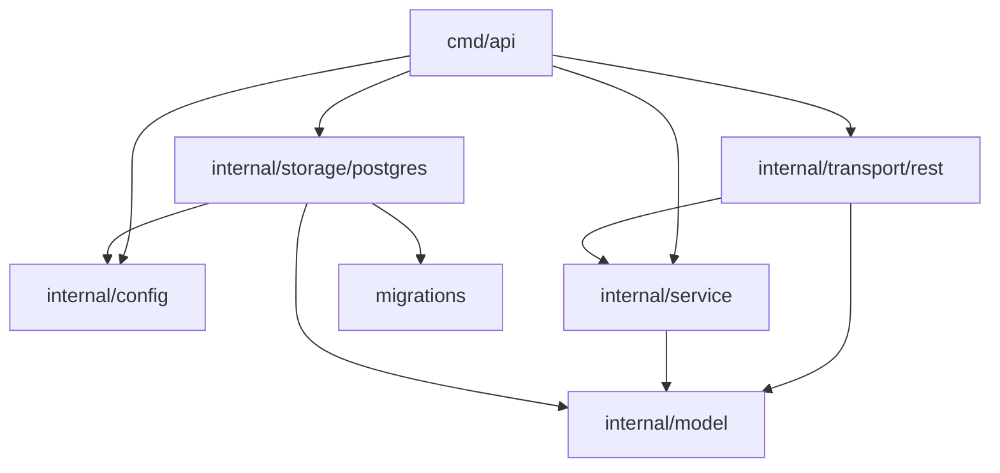
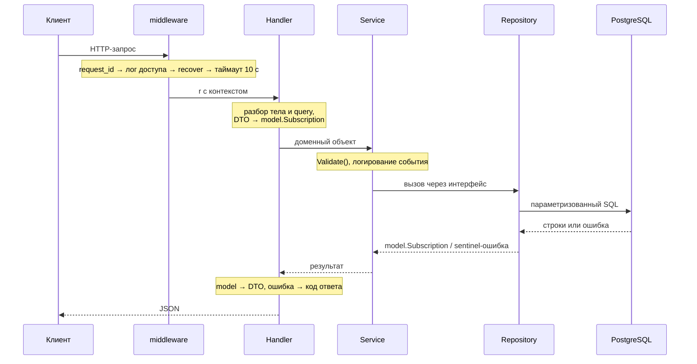

# Архитектура

Документ описывает, как сервис устроен внутри и почему именно так. Как его
запускать и какие у API ручки — в [README](README.md).

## Границы сервиса

Сервис хранит записи о подписках и считает их суммарную стоимость за период.
Пользователями он не управляет и их существование не проверяет: `user_id` —
просто идентификатор из внешней системы. Это прямо задано в ТЗ и объясняет,
почему в схеме нет таблицы пользователей и внешних ключей.

Аутентификации нет — сервис рассчитан на работу за шлюзом, который её и
выполняет.

## Зависимости пакетов



Главное свойство — **`model` не импортирует ничего из проекта**. Это лист
графа, на который опираются все остальные слои. Стрелки идут внутрь: транспорт
знает про сервис, сервис — про модель, хранилище — про модель; в обратную
сторону не знает никто.

Отсюда же правило, которое легко нарушить: типы, нужные и сервису, и
хранилищу (`Filter`, `Page`), лежат в `model`. Если положить их в `service`, то
`storage/postgres` начнёт импортировать слой выше себя и граф развернётся.
Такое уже случалось и было исправлено.

Обратная крайность тоже была: вместе с типами в `model` уехали границы размера
страницы. Размер страницы — политика HTTP-слоя, а не свойство предметной
области, поэтому `DefaultLimit` и `MaxLimit` живут в `rest`.

## Слои

| Пакет | Отвечает за | Не знает про |
| --- | --- | --- |
| `cmd/api` | сборку зависимостей, запуск и остановку процесса | бизнес-правила |
| `internal/config` | чтение настроек из окружения, построение DSN | всё остальное |
| `internal/model` | сущность подписки, её инварианты, формат даты `MM-YYYY` | HTTP, SQL |
| `internal/service` | сценарии работы с подписками, интерфейс `Repository` | HTTP, SQL |
| `internal/storage/postgres` | SQL-запросы, пул соединений, миграции | HTTP |
| `internal/transport/rest` | маршруты, разбор запроса, коды ответа, DTO | SQL |
| `migrations` | SQL-файлы схемы, встроенные через `embed` | всё остальное |

Соотношение объёмов показательно: `transport/rest` — самый большой пакет
(577 строк), потому что вся работа с недоверенным вводом сосредоточена там.
`service` — 117 строк, и это нормально: бизнес-логики в задаче мало, основная
сложность в SQL и в разборе запроса.

## Путь запроса



Порядок middleware не произволен: логгер стоит **снаружи** recoverer, иначе
паника разворачивает стек мимо логгера и упавшие запросы не попадают в лог
доступа вовсе. Этот порядок закреплён тестом.

## Валидация: почему в двух местах

Проверки намеренно разделены, и граница проходит по смыслу:

- **`transport/rest`** проверяет *форму*: корректность JSON, тип поля, формат
  `MM-YYYY`, разбор UUID, границы `limit`/`offset`. Всё это свойства протокола,
  а не предметной области.
- **`model.Validate`** проверяет *инварианты записи*: неотрицательная
  стоимость, непустое название, дата окончания не раньше даты начала. Эти
  правила верны независимо от того, пришла запись по HTTP или иначе.

Границы значений в `model` намеренно повторяют ограничения колонок:
`MaxPrice` соответствует `INTEGER`, `MaxServiceNameLength` — `VARCHAR(255)`.
Без этого некорректный ввод доходил бы до Postgres и возвращался клиенту как
`500` — ошибка сервера вместо ошибки запроса.

Третий рубеж — `classify` в хранилище: ошибки Postgres, вызванные значениями
из запроса, переводятся в `ErrValidation`. Список кодов узкий и применяется
только к записи. Расширять его нельзя: код, недостижимый пользовательским
вводом, означает ошибку в SQL, и превращать её в `400` — значит маскировать
баг сервера под ошибку клиента.

## Ошибки

Сквозной механизм — sentinel-ошибки и `errors.Is`. Нижние слои оборачивают
причину через `%w`, транспорт разбирает цепочку и выбирает код ответа.

| Sentinel | Где объявлен | Код ответа |
| --- | --- | --- |
| `model.ErrValidation` | `model` | `400` |
| `model.ErrNotFound` | `model` | `404` |
| `errPayloadTooLarge` | `rest` | `413` |
| `errUnsupportedMediaType` | `rest` | `415` |
| `context.DeadlineExceeded` | stdlib | `504` |
| `context.Canceled` | stdlib | ответа нет, лог `info` |
| всё остальное | — | `500`, детали только в лог |

Ошибки протокола объявлены в `rest`, а не в `model`: домена они не касаются.

Два правила, которые легко нарушить:

1. **Наружу не уходят внутренние детали.** Имена Go-структур, их полей и
   типов, текст стандартной библиотеки, коды SQLSTATE остаются в логе. Ошибка
   разбора JSON переводится в свою формулировку по типу — `*json.SyntaxError`,
   `*json.UnmarshalTypeError`, `*http.MaxBytesError`.
2. **Отмена запроса — не отказ сервиса.** Иначе мониторинг по `level=ERROR`
   срабатывает на каждом отвалившемся клиенте.

## Модель данных

Одна таблица:

```sql
subscriptions(
    id           UUID PRIMARY KEY,
    service_name VARCHAR(255) NOT NULL,
    price        INTEGER      NOT NULL CHECK (price >= 0),
    user_id      UUID         NOT NULL,
    start_date   DATE         NOT NULL,
    end_date     DATE,
    CHECK (end_date IS NULL OR end_date >= start_date)
)
```

Ключевое решение — **даты хранятся как `DATE`, а не строкой**. Формат
`MM-YYYY` из ТЗ живёт только на границе API: `model.ParseDate` разбирает его
при входе, `model.FormatDate` собирает при выходе, внутри — первое число
месяца. Если бы строка хранилась как есть, подсчёт суммы за период пришлось бы
делать в Go, выгружая все записи и разбирая строки.

`end_date IS NULL` означает бессрочную подписку. Это не «фильтр не задан», а
настоящее бизнес-условие, и в SQL оно выглядит именно так.

Индексы покрывают оба фильтра из ТЗ; по названию сервиса — индекс по выражению
`lower(service_name)`, потому что сравнение регистронезависимое. Подробности с
замерами — в [README](README.md#индексы).

## Два нетривиальных места в SQL

**Расчёт суммы идёт одним запросом.** Для каждой подписки берётся пересечение
её срока с запрошенным периодом, число месяцев в пересечении умножается на
месячную стоимость. Записи в приложение не выгружаются.

**Условия `WHERE` собираются динамически.** Универсальный статический SQL вида
`$1 IS NULL OR user_id = $1` выглядит аккуратнее, но на generic-плане
планировщик обязан построить план, годный для обеих веток, и индексом
воспользоваться уже не может — выборка вырождается в перебор всей таблицы.
Поэтому условие для незаданного фильтра не добавляется вовсе. В текст запроса
подставляются только номера плейсхолдеров; значения всегда уходят параметрами.

## Жизненный цикл процесса

1. Читается конфигурация из переменных окружения.
2. Накатываются миграции — до создания пула, чтобы сервис не начал работать по
   неактуальной схеме.
3. Создаётся пул соединений и проверяется `Ping`.
4. Собираются зависимости и запускается HTTP-сервер.
5. По `SIGINT`/`SIGTERM` — `server.Shutdown` с таймаутом 10 секунд.

Всё тело вынесено в `run() error`, и это не косметика: если завершаться из
`main` обычным возвратом, процесс отдаёт код 0, и Docker с Kubernetes считают
падение штатным завершением — `restart: on-failure` не срабатывает.

Миграции встроены в бинарь через `embed`, поэтому образу не нужны внешние
файлы, а повторный запуск ничего не меняет: версия хранится в
`schema_migrations`.

## Наблюдаемость

Логи структурные (`slog`, JSON). Каждая строка содержит `request_id`, общий для
строки доступа и строки об ошибке, — по нему они сопоставляются при разборе
инцидента. Сообщения на русском, ключи атрибутов и значения `code` —
английские: по ним фильтруют и грепают.

`/healthz` пингует базу и отдаёт `503`, если она не отвечает. На нём же
построен healthcheck в compose, поэтому `docker ps` показывает реальное
состояние, а не факт живости процесса.

## Тестирование

Тесты — юнит-тесты, база данных не нужна ни одному из них.

| Пакет | Что проверяется | Чем подменяется |
| --- | --- | --- |
| `model` | разбор `MM-YYYY`, инварианты записи | ничем |
| `service` | валидация, проверка периода, передача параметров | заглушка `Repository` |
| `rest` | разбор запроса, коды ответа, пагинация, паника, health | заглушки `Repository` и `Pinger` |

Тестируемость обеспечивает интерфейс `Repository`: ради него он и заведён.
Тесты HTTP-слоя ходят через `httptest` и настоящий роутер со всеми middleware —
то есть проверяют и порядок их регистрации.

SQL не покрыт: для этого нужен настоящий Postgres. Правильный способ —
`testcontainers-go`, поднимающий одноразовую базу на время прогона; ТЗ тестов
не требует, поэтому не добавлено.

## Куда что добавлять

| Задача | Порядок действий |
| --- | --- |
| Новое поле у подписки | миграция → `model.Subscription` → `columns` и `scan` в хранилище → DTO в `rest` → `swag init` |
| Новая ручка | обработчик в `handler.go` → маршрут в `router.go` → аннотации → `swag init` |
| Новое правило валидации | инвариант записи — в `model.Validate`; формат запроса — в `rest` |
| Новый фильтр выборки | `model.Filter` → `filterConditions` → `parseFilter` → индекс в миграции |
| Новый код ответа | sentinel в `rest` или `model` → ветка в `writeError` → строка в таблице README |

Правило для миграций: **применённую миграцию не редактируют**. У тех, кто её
накатил, версия уже записана в `schema_migrations`, и изменённый файл просто не
выполнится. Нужна новая.

Папка `docs/` генерируется целиком и руками не правится.

## Что намеренно не сделано

| Решение | Причина |
| --- | --- |
| Нет кеша | Данные меняются редко, но и читаются немного; кеш добавил бы инвалидацию без выигрыша |
| Нет транзакции вокруг `count` и `select` в списке | Расхождение возможно только под конкурентной записью и стоит дешевле, чем `repeatable read` на каждый список |
| `POST` не идемпотентен | Соответствует HTTP. Для запрета дублей нужен `Idempotency-Key` или уникальный индекс, но последний запретил бы две подписки на один сервис |
| Пул соединений с настройками по умолчанию | Требований по нагрузке нет; явные значения — ручка без обоснования |
| Нет интеграционных тестов и CI | Вне ТЗ |

Каждое из этих решений обратимо и локально: ни одно не размазано по слоям.
